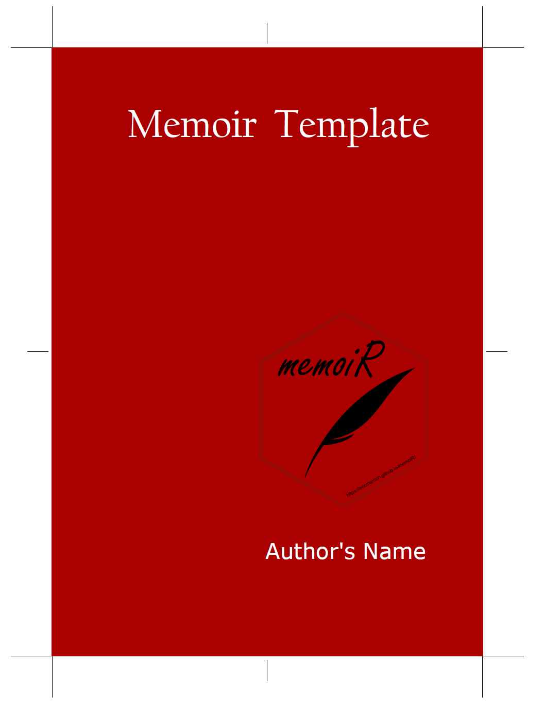

```{r}
#| label: setup
#| include: false
knitr::opts_chunk$set(cache = FALSE)
set.seed(97310)
```


Markdown is a very simple language for producing various types of documents: HTML, PDF, and Word among others.
Its documentation is available at the RStudio website[^2].

[^2]: <http://rmarkdown.rstudio.com/articles.html>

Markdown is extended by Bookdown[^3], which allows for book writing and more efficient syntax for articles.
Articles of the memoiR package are made with Markdown in RStudio: knitr processes the Markdown code, passes it to Pandoc for transformation into LaTeX, finally LaTeX compiles it into PDF.

[^3]: <https://bookdown.org/yihui/bookdown/>


## Motivation

Markdown is very easy to learn.

Markdown allows you to integrate your R code for a *reproducible* result.

Markdown allows to produce, without rewriting the text, a document in different formats: HTML, LaTeX or Word for example.


## How to do it

In RStudio, create a new document of type Document R Markdown. 
The wizard allows you to choose between different formats.

Click on _From template_: from templates installed by packages. 
The memoiR package templates are displayed: choose aither *Simple Article* or *Stylish Article*.

It is better to create an RStudio project to benefit from all the possibilities: _File_ / _New Project_ then use the wizard to create a project from an existing folder.

Write the document in RStudio.

Clicking the **Knit** button in RStudio generates the document in the requested format.


# Code

The main features of R Markdown are summarized here.


## R code

R code is included in code chunks:

````
```{r}`r ''`
#| label: cars
#| echo: false
head(cars)
```
````

```{r}
#| label: cars
#| echo: false
head(cars)
```


## Tables

The horizontal `-` and vertical separators `|` allow you to draw a table according to Markdown syntax, but this is not the best method.

Tables can also be produced by R code.
The content of the table is in a dataframe.
The `kbl()` function in the _kableExtra_ package (which enhances the original `kable()` function from _knitr_) prepares the table for display and passes the result to the `kable_styling` function for final formatting.

````
```{r}`r ''`
#| label: iris
#| echo: true
#| warning: false
library("kableExtra")
names(iris) <- c("Sepal length", "Width", "Petal length", "Width", "Species")
kbl(
  head(iris), 
  caption = "Table created by R", longtable = TRUE, booktabs = TRUE
) |>
  kable_styling(bootstrap_options = "striped", full_width = FALSE)
```
````

```{r}
#| label: kable
#| echo: false
#| warning: false
library("kableExtra")
names(iris) <- c("Sepal length", "Width", "Petal length", "Width", "Species")
kbl(
  head(iris), 
  caption = "Table created by R", longtable = TRUE, booktabs = TRUE
) |>
  kable_styling(bootstrap_options = "striped", full_width = FALSE)
```

The caption is specified by the `caption` argument and referencing is possible because the table receives a label whose name is `tab:` followed by the name of the code snippet: write something like `see table \@ref(tab:iris))`.
Always use the `booktabs = TRUE` argument so that the thickness of the separator lines is optimal in LaTeX.
The `bootstrap_options = "striped"` option provides more readable tables in HTML.

In LaTeX, tables can have the width of the column and possibly span multiple pages, or use the width of the page. 

````
```{r}`r ''`
#| label: Paracou
#| echo: false
#| warning: false
logging <- data.frame(
  Treatment = c("Control", "T1", "T2", "T3"),
  Timber = c(
    "", 
    "DBH $\\geq$ 50 cm, commercial species, $\\approx$ 10 trees/ha", 
    "DBH $\\geq$ 50 cm, commercial species, $\\approx$ 10 trees/ha",
    "DBH $\\geq$ 50 cm, commercial species, $\\approx$ 10 trees/ha"
  ),
  Thinning = c(
    "", 
    "", 
    "DBH $\\geq$ 40 cm, non-valuable species, $\\approx$ 30 trees/ha", 
    "DBH $\\geq$ 50 cm, non-valuable species, $\\approx$ 15 trees/ha  "
  ),
  Fuelwood = c(
    "", 
    "", 
    "", 
    "40 cm $\\leq$ DBH $\\leq$ 50 cm, non-valuable species, $\\approx$ 15 trees/ha"
  ),
  AGBLost = c(0, "$[12\\%-33\\%]$", "$[33\\%-56\\%]$", "$[35\\%-56\\%]$")
)
names(logging)[5] <- "\\%AGB lost"
kbl(
  logging, 
  caption = "Summary of the disturbance intensity for the 4 plot treatments in Paracou.", 
  longtable = FALSE,
  booktabs = TRUE, 
  escape = FALSE
) |>
  kable_styling(bootstrap_options = "striped", full_width = TRUE)
```
````

```{r}
#| label: Paracou
#| echo: false
#| warning: false
logging <- data.frame(
  Treatment = c("Control", "T1", "T2", "T3"),
  Timber = c(
    "", 
    "DBH $\\geq$ 50 cm, commercial species, $\\approx$ 10 trees/ha", 
    "DBH $\\geq$ 50 cm, commercial species, $\\approx$ 10 trees/ha",
    "DBH $\\geq$ 50 cm, commercial species, $\\approx$ 10 trees/ha"
  ),
  Thinning = c(
    "", 
    "", 
    "DBH $\\geq$ 40 cm, non-valuable species, $\\approx$ 30 trees/ha", 
    "DBH $\\geq$ 50 cm, non-valuable species, $\\approx$ 15 trees/ha  "
  ),
  Fuelwood = c(
    "", 
    "", 
    "", 
    "40 cm $\\leq$ DBH $\\leq$ 50 cm, non-valuable species, $\\approx$ 15 trees/ha"
  ),
  AGBLost = c(0, "$[12\\%-33\\%]$", "$[33\\%-56\\%]$", "$[35\\%-56\\%]$")
)
names(logging)[5] <- "\\%AGB lost"
kbl(
  logging, 
  caption = "Summary of the disturbance intensity for the 4 plot treatments in Paracou.", 
  longtable = FALSE, 
  booktabs = TRUE, 
  escape = FALSE
) |>
  kable_styling(bootstrap_options = "striped", full_width = TRUE)
```

This table contains mathematics: the `escape = FALSE` option is necessary.

Finally, the `full_width = FALSE` option adjusts the width of the table to its content instead of occupying all the available width.
It must be `TRUE` for correct formatting of two-column tables in LaTeX.


## Figures

Figures can be created by some R code.

````
```{r}`r ''`
#| label: pressure
#| fig-cap: "Figure title"
plot(pressure)
```
````

```{r}
#| label: pressure
#| fig-cap: "Figure title"
plot(pressure)
```

With Bookdown, a label is associated with each figure: its name is `fig:xxx` where `xxx` is the name of the R code snippet.
Cross-references are made with the command `\@ref(fig:xxx)`.

In the PDF output of Stylish Articles, a figure can use the full width of the page by adding the following options to the header of the code snippet that generates it: `fig.env="figure*"` and `out.extra=""`.

Existing figures are integrated into a piece of code by the `include_graphics` function.

````
```{r}`r ''`
#| label: cover
#| out-width: 60%
#| fig-cap: "A figure from a file"
#| echo: false
knitr::include_graphics("images/trim.png")
```
````

```{r}
#| label: cover
#| out-width: 60%
#| fig-cap: "A figure from a file"
#| echo: false

```

Systematically place these files in the `images` folder for the automation of GitHub pages.


## Captions

Figure and table captions can be long, include formatted text, maths, references...
The only limit is they cannot contain more than a single paragraph.
Such captions must be stored in a separate paragraph starting with `(ref:ChunkName)`and a space.
The text of the caption follows.

In the figure chunk heading, the caption is called in the `fig.cap` field:

````
(ref:ChunkName) This *is* a figure legend.
```{r}`r ''`
#| label: ChunkName
#| fig-cap: "(ref:ChunkName)"
plot(pressure)
```
````

In tables, the `caption` argument of the `kbl()` function is used the same way.


## Lists

Lists are indicated by `*`, `+` and `-` (three hierarchical levels) or numbers `1.`, `i.` and `A.` (numbered lists).
Indentation of lists indicates their level: `*`, `+` and `-` may be replaced by `-` at all levels, but four spaces are needed to nest a list into another.

* First element of a list
    + sub-list
* Second element
* Continuation of the list

Leave an empty line before and after the list, but not between its items.


## Math

Equations in LaTeX format can be inserted in line, like $A=\pi r^2$ or isolated like $$e^{i \pi} = -1.$$

They can be numbered using the `equation` environment:

```
\begin{equation}
  A = \pi r^2.
  (\#eq:disk)
\end{equation}
```

Cross referencing is supported: `see equation \@ref(eq:disk)`.


## Cross-references

Figures and tables have an automatically generated label, identical to the name of the code snippet prefixed with `fig:` and `tab:`.

For equations, the label is added manually by the code `(\#eq:xxx)` before the end of the equation.

Sections can be tagged by ending their title with `{#yyy}`.

In all cases, the call to the reference is made by the command `\@ref()`.


## Bibliography

Bibliographic references included in the `references.bib` file can be called by `[@CitationKey]`, in parentheses [@Xie2016], or without square brackets, in the text, as @Xie2018 .

The bibliography is processed by Pandoc when producing Word or HTML documents.
The bibliographic style can be specified, by adding the line 

    csl:file_name.csl
    
in the document header and copying the _.csl_ style file to the project folder.
More than a thousand styles are available[^4].

[^4]: <https://github.com/citation-style-language/styles>

For PDF documents, the bibliography is managed by natbib.
The style is declared in the header:

    biblio-style: chicago

It can be changed as long as the appropriate `.bst` file (by default: `chicago.bst`) is included in the project. 


# Specificities of document types

The templates are designed to produce documents in PDF, HTML or Word format.
Use the list of choices in the _Knit_ button to choose the output format.

## HTML

While writing, prefer knitting to HTML format for its speed of execution.

The standard HTML output formats are "HTML document" and "GitBook", both optimized for on-screen reading.
More specific formats are from the **rmdformats** and **distill** packages.

Specific instructions apply to each format:

- GitBook: A download button is available in the document menu bar. It will work if the document is also knitted in PDF format and if the file name is entered in the download field of the YAML header.
- rmdformats: read the [documentation](https://github.com/juba/rmdformats) of the package.
- distill articles: read the [documentation](https://rstudio.github.io/distill/) of the package.
    - the date item in the HTML header must be formatted as "year/month/day" to be interpreted correctly. The current date must be changed from its default format in templates `'%d %B %Y'` to `'%Y %B %d'`.
    - sections may be numbered by adding a specific pandoc option in the YAML header, but cross references to section numbers are [not supported yet](https://github.com/rstudio/distill/issues/287).
    
```
output:
  bookdown::html_document2:
    base_format: distill::distill_article
    pandoc_args: ["--number-sections"]
```

## PDF

The document is formatted for self-archiving of well-formatted articles (Stylish Article) or a simpler, LaTeX-article-style output (Simple Article).

### LaTeX preamble

LaTeX commands can be added in the preamble of the produced LaTeX file, for example to load additional packages.
These commands are in the `preamble:` section of the Markdown file header.

The default commands allow to show the use of the hyphenation command:
```
\hyphenation%
  {bio-di-ver-si-ty sap-lings}
```

Other commands can be added as needed.
Warning:

- Comments are not allowed.
- Complex commands (e.g. `\renewenvironment`) must be entered on a single line otherwise they will be destroyed by knitr at the first knitting in HTML.

### Forcing line breaks

Hyphenation is handled automatically in LaTeX.
If a word is not hyphenated correctly, add its hyphenation in the preamble of the file with the command `hyphenation` (words are separated by spaces, hyphenation locations are represented by dashes).

If LaTeX can't find a solution for the line break, for example because some code is too long a non-breaking block, add the LaTeX command `\break` to the line break location.
Do not leave a space before the command. 
The HTML document ignores LaTeX commands.

### Languages

Languages are declared in the document header.

The main language of the document (`lang`) changes the name of some elements, such as the table of contents.
The change of language in the document (one of `otherlangs`) is managed in LaTeX but not in HTML by inserting on a new line the following command: 
```
\selectlanguage{english}
```

The current language has an effect only in LaTeX output: a space is added before double punctuation in French, the size of spaces is larger at the beginning of sentences in English, etc.
The `\selectlanguage` command is simply ignored in HTML.

Language codes are used in the header, such as `en-US` but language names are necessary in \selectlanguage{}`.
Name matches are listed in table 3 of the polyglossia package documentation[^5].

[^5]: http://mirrors.ctan.org/macros/unicodetex/latex/polyglossia/polyglossia.pdf


## Word

Word outputs can be formatted or copied into a template. 
The standard text styles are "First Paragraph" and "Body Text" rather than "Normal".

The Word format allows to produce a manuscript for journals that do not support LaTeX.
The bibliographic style of the journal is most likely available in _.csl_ format, which minimizes manual preparation.

The level 1 title _References_ must be added manually to Word files.

# References

